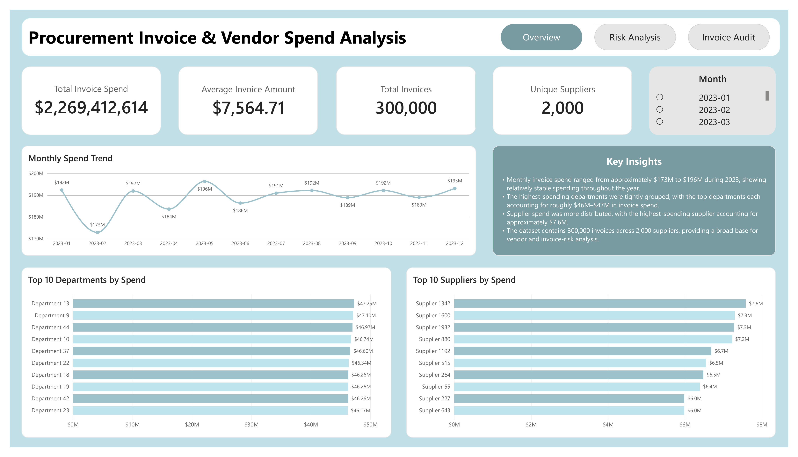
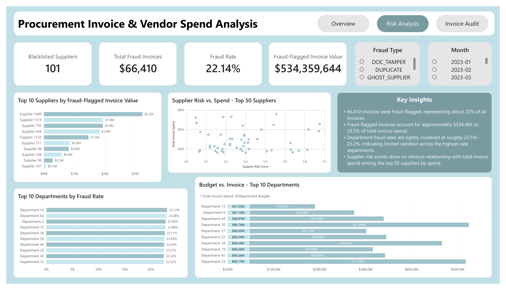
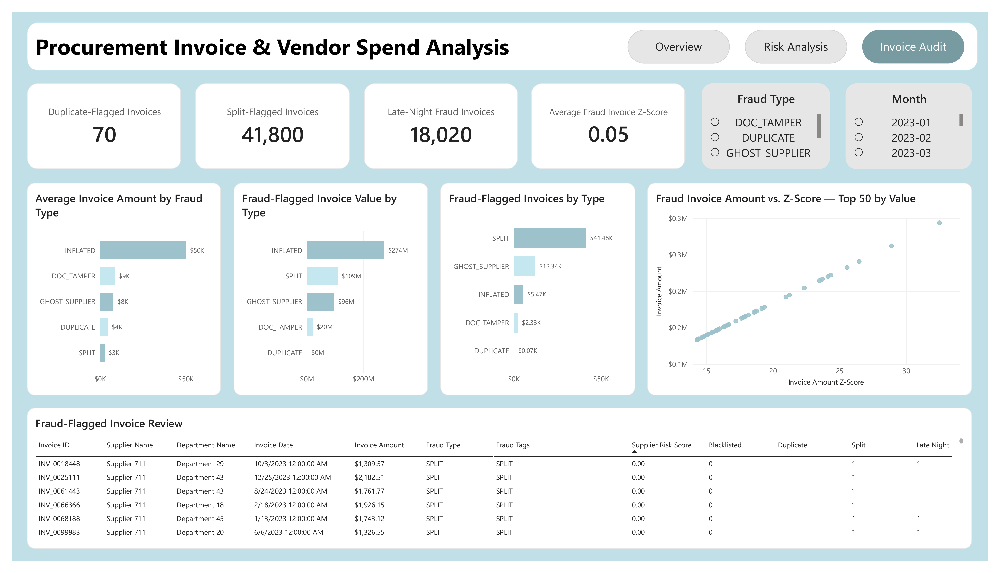

# Procurement Invoice & Vendor Spend Analysis

A Power BI analysis of **300,000 procurement invoices** examining vendor spend, departmental budgets, supplier risk, and fraud-flagged invoice activity.

This project was designed to simulate the type of financial and operational analysis performed in accounting, procurement, and financial operations roles, with a focus on invoice monitoring, spend analysis, fraud risk, and exception review.

---

## Project Overview

Organizations processing large volumes of supplier invoices need visibility into where money is being spent, which vendors and departments are driving costs, and which transactions may require additional review.

This project analyzes one year of synthetic procurement activity across:

- **300,000 invoices**
- **2,000 suppliers**
- **50 departments**
- **$2.27B in total invoice spend**

The analysis focuses on three areas:

1. Overall procurement spend and invoice activity.
2. Supplier and department risk.
3. Invoice-level fraud and audit indicators.

The final Power BI report contains three interactive pages:

- **Spend & Invoice Overview**
- **Risk Analysis**
- **Invoice Audit**

---

## Dataset

Source: [Procurement Invoice Fraud Dataset on Kaggle](https://www.kaggle.com/datasets/tokelomashile2/procurement-invoice-fraud-dataset)

The dataset is **synthetic** and was created for procurement fraud analysis. Fraud classifications therefore represent generated fraud scenarios rather than confirmed real-world fraud cases.

### Files Used

| File | Purpose |
|---|---|
| `invoices.parquet` | Main transaction table containing invoice amount, date, supplier, department, payment terms, and invoice type. |
| `suppliers.parquet` | Supplier attributes including risk score, blacklist status, supplier age, and average invoice amount. |
| `departments.parquet` | Department information including region and annual budget. |
| `labels.parquet` | Fraud labels including fraud status, fraud type, tags, and explanations. |
| `behavioural_features.parquet` | Invoice-level behavioral indicators including duplicate, split, late-night, and invoice amount deviation measures. |

The dataset contains fraud classifications including:

- `SPLIT`
- `INFLATED`
- `GHOST_SUPPLIER`
- `DOC_TAMPER`
- `DUPLICATE`

---

## Data Model

The Power BI model uses `invoices` as the central transaction table.

Relationships include:

```text
Suppliers
   1
   |
   *
Invoices
   *
   |
   1
Departments

Invoices 1 ─── 1 Labels

Invoices 1 ─── 1 Behavioural Features

Date 1 ─── * Invoices
```

A separate Date table was created to support monthly and time-based analysis.

---

## Business Questions

The analysis was designed to answer questions including:

- How much is being spent on supplier invoices?
- How does procurement spend change throughout the year?
- Which suppliers account for the most invoice spend?
- Which departments account for the most spend?
- How does department invoice spend compare with annual budgets?
- Which suppliers have the greatest fraud-flagged invoice exposure?
- Which departments have the highest fraud rates?
- Which fraud types occur most frequently?
- Which fraud types represent the greatest dollar exposure?
- Are higher supplier risk scores associated with higher supplier spend?
- Which individual invoices may warrant further review?

---

# Dashboard

## Page 1 — Spend & Invoice Overview

The first page provides an executive-level view of procurement activity.

### KPIs

- **Total Invoice Spend:** $2.27B
- **Average Invoice Amount:** $7,564.71
- **Total Invoices:** 300,000
- **Unique Suppliers:** 2,000

### Analysis

The page includes:

- Monthly invoice spend trend.
- Top 10 departments by spend.
- Top 10 suppliers by spend.
- Interactive month filtering.

### Key Findings

- Monthly invoice spend ranged from approximately **$173M to $196M**, showing relatively stable procurement spending throughout 2023.
- The highest-spending departments were tightly grouped, with each of the top departments accounting for approximately **$46M–$47M** in invoice spend.
- Supplier spending was more distributed, with the highest-spending supplier accounting for approximately **$7.6M**.
- The organization processed a large and diverse supplier base of **2,000 suppliers across 300,000 invoices**.



---

## Page 2 — Risk Analysis

The second page focuses on supplier risk, department-level fraud activity, and financial exposure associated with fraud-flagged invoices.

### KPIs

- **Blacklisted Suppliers:** 101
- **Fraud-Flagged Invoices:** 66,410
- **Fraud Rate:** 22.14%
- **Fraud-Flagged Invoice Value:** $534.4M

### Analysis

The page includes:

- Top suppliers by fraud-flagged invoice value.
- Supplier risk score vs. total spend.
- Top departments by fraud rate.
- Department annual budget vs. invoice spend.
- Fraud type and month filtering.

### Key Findings

- **66,410 invoices** were fraud-flagged, representing approximately **22% of all invoices**.
- Fraud-flagged invoices represented approximately **$534.4M**, or about **23.5% of total invoice spend**.
- Fraud rates among the highest-rate departments were tightly clustered around **22.5%–23.2%**, indicating limited variation between departments.
- Among the top 50 suppliers by spend, **supplier risk score showed no obvious relationship with total invoice spend**.
- All top-spending departments remained below their listed annual department budgets.



---

## Page 3 — Invoice Audit

The final page provides a more detailed audit-oriented view of fraud patterns and individual invoices requiring review.

### KPIs

- **Duplicate-Flagged Invoices:** 70
- **Split-Flagged Invoices:** 41,800
- **Late-Night Fraud Invoices:** 18,020
- **Average Fraud Invoice Z-Score:** 0.05

### Analysis

The page includes:

- Fraud-flagged invoice count by fraud type.
- Fraud-flagged invoice value by fraud type.
- Average invoice amount by fraud type.
- Invoice amount vs. invoice amount Z-score for the 50 highest-value fraud invoices.
- Detailed fraud-flagged invoice review table.
- Fraud type and month filtering.

### Key Findings

- **Split invoices were the most frequently occurring fraud type**, with approximately **41.5K fraud-flagged invoices**.
- Although split invoices occurred most frequently, **inflated invoices represented the largest financial exposure**, accounting for approximately **$274M in fraud-flagged invoice value**.
- Inflated invoices averaged approximately **$50K per invoice**, compared with approximately **$3K for split invoices**.
- This indicates that fraud frequency and financial impact are not necessarily the same: split activity creates greater transaction volume, while inflated invoices create substantially greater dollar exposure.
- Among the highest-value fraud invoices, invoice amount and invoice amount Z-score showed a strong positive relationship, with larger invoices also appearing more abnormal relative to typical supplier invoice behavior.
- The detailed audit table allows users to review individual invoices alongside supplier risk, blacklist status, fraud classification, duplicate flags, split flags, and late-night submission indicators.



---

## Audit Priorities & Recommendations

Based on the analysis, several areas would warrant additional review in a real procurement environment:

- Prioritize **inflated invoices** for high-dollar review because they represent the largest fraud-flagged financial exposure.
- Monitor **split invoice activity** because it represents the greatest volume of fraud-flagged transactions.
- Review high-value invoices with unusually high invoice amount Z-scores relative to normal supplier behavior.
- Apply additional scrutiny to fraud-flagged transactions associated with **blacklisted or higher-risk suppliers**.
- Use supplier and department-level monitoring alongside invoice-level behavioral indicators rather than relying on a single risk metric.
- Maintain drill-down capabilities so analysts can move from summary KPIs to individual transactions requiring investigation.

---

### AI-Assisted Workflow

Microsoft Copilot was used to support analytical brainstorming, DAX troubleshooting, and dashboard development. Calculations, relationships, results, and analytical conclusions were independently reviewed and validated against the underlying data.

---

## Key DAX Measures

Measures developed for the report include:

- Total Invoice Spend
- Total Invoices
- Average Invoice Amount
- Unique Suppliers
- Blacklisted Suppliers
- Total Fraud Invoices
- Fraud Rate
- Fraud-Flagged Invoice Value
- Department Budget
- Budget Utilization %
- Duplicate-Flagged Invoices
- Split-Flagged Invoices
- Late-Night Fraud Invoices
- Average Fraud Invoice Z-Score

---

## Limitations

- The dataset is **synthetic**, so fraud rates and financial results should not be interpreted as representative of real-world procurement activity.
- Fraud classifications were generated as part of the dataset rather than confirmed through real investigations.
- Supplier and department records contain IDs rather than descriptive organization names.
- **Fraud-flagged invoice value represents the value associated with labeled transactions, not confirmed financial loss or money recovered.**
- Behavioral indicators such as late-night submissions, high Z-scores, or supplier risk scores should be treated as investigative signals rather than independent proof of fraud.

---

## Repository Structure

```text
procurement-invoice-analysis/
│
├── data/
│   ├── behavioural_features.parquet
│   ├── departments.parquet
│   ├── invoices.parquet
│   ├── labels.parquet
│   └── suppliers.parquet
│
├── images/
│   ├── invoice_audit.png
│   ├── overview.png
│   └── risk_analysis.png
│
├── power-bi/
│   └── invoice_vendor_spend_analysis.pbix
│
└── README.md
```

---

## Power BI File

The complete interactive Power BI report is available here:

[`power-bi/invoice_vendor_spend_analysis.pbix`](power-bi/invoice_vendor_spend_analysis.pbix)

---

## Project Takeaway

This project demonstrates an end-to-end approach to procurement and financial operations analysis by combining invoice transactions, supplier risk information, department budgets, fraud classifications, and behavioral indicators into a three-page Power BI report.

The analysis highlights the importance of evaluating both **transaction frequency and financial exposure**. While split invoices represented the largest volume of fraud-flagged activity, inflated invoices represented substantially greater dollar exposure, demonstrating why invoice monitoring should consider both the number and financial magnitude of exceptions.